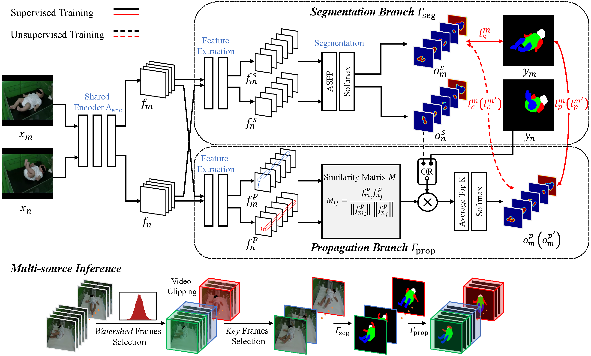
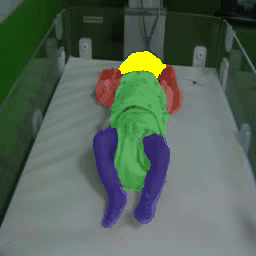
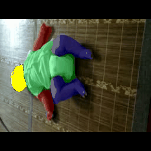
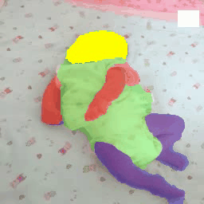

SiamParseNet
====

The code implementation of our MICCAI20 paper [SiamParseNet: Joint Body Parsing and Label Propagation in Infant Movement Videos
](https://arxiv.org/abs/2007.08646). 

You may be also interested in our follow-up work [Semi-supervised Body Parsing and Pose Estimation for Enhancing Infant General Movement Assessment](https://arxiv.org/abs/2210.08054), which applied SiamParseNet to the real clinical settings and is publised on Medical Image Analysis 2023. We also release a infant body parsing video dataset in this follow-up work ([dataset link](https://github.com/nihaomiao/Youtube-Infant-Body-Parsing)).

Example Results
----

Acknowledgement
----
We acknowledge the code about DeepLab from [speedinghzl](https://github.com/speedinghzl/Pytorch-Deeplab).
